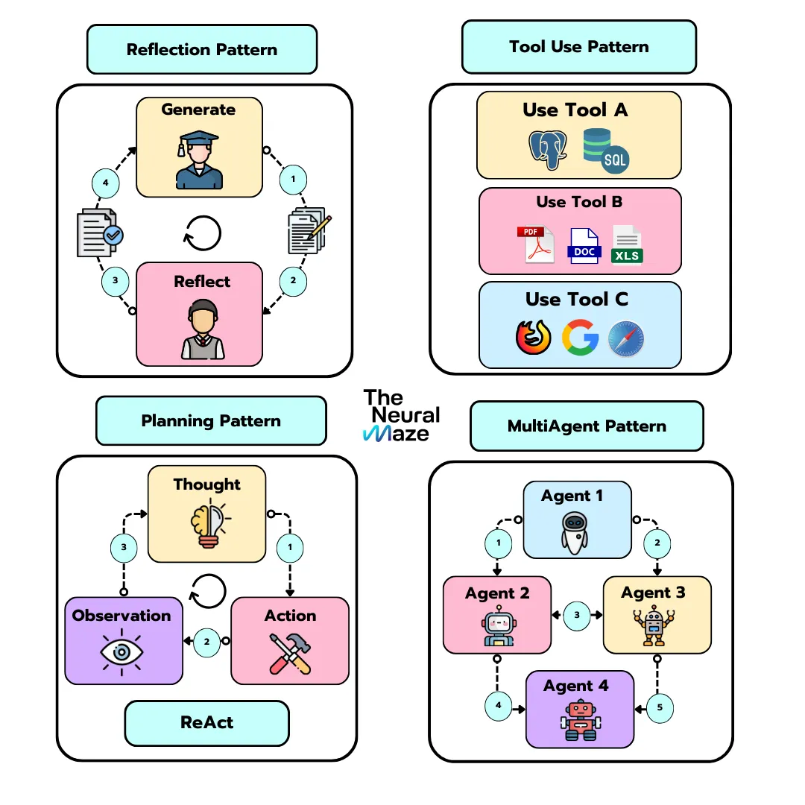

- AI agents are autonomous systems that can interact with external/internal tools to performa a task
    - Problem solving skills
    - Ability to take actions - use external tools to search database, and execute workflows
- [Some source](http://theneuralmaze.substack.com/p/the-ai-engineering-playbook)
### LLM as the brain

- The agent’s core, enabling understanding, reasoning, and response generation

### Tooling
- Why tools are needed for building an AI agent?
    1. Building agent is **Complex**. For an agent one need to take care of:
        1. Prompt templates
        2. Tool execution logic
        3. Memory management
        4. State tracking
        5. Error handling
        6. Function calling pipelines
        7. Logging & monitoring
        8. Async orchestration
    2. **Integration** with various AI models into a cohesive system in challenge
    3. **Scalability:** Developing AI agents that can scale efficiently requires robust framework
- These Agentic tools Like LangChain, LangGraph etc
    - **Simplify** the AI agent development, and make it more accessible. Abstracts the complex functionalities.
    - Provide **Modularity**, that can be easily integrated and customised
    - Pre-build functionalities accelerates the development cycle and reduce time and hence bring **Efficiency**
- LangChain
    - Support a wide range of integration, including cloud storage(Azure, Amazon, Google), web scrapping tools and various APIs
    - Capable of reading over 50 document types and data sources, enabling efficient data processing.
    - offers a broad spectrum of tools for tasks such as code generation, debugging, and testing, enhancing developer productivity.
    - Provide build-in short-term, long-term, and entity memory enabling agents to maintain context across interactions.
    - Why to use? Chatbots, RAGs, ReAct Agent and code Analysis
    
    ### Types of Prompt Templates in LangChian
    
    - PromptTemplate: Helps create a template for a string-based prompt
    - ChatPromptTemplate: Helps create templates to prompt chat models, which is usually a list of chat messages
    - FewShotChatMessagePromptTemplate: Helps create chat prompt templates that support few-shot examples
    
    ### Types of Output Parsers in LangChain
    
    - PydanticOutputParser: Uses the pydantic library to build a data class to format data into structured field
    - JsonOutputParser: Formats output into a well-defined JSON structure
    - CommaSeparatedListOutputParser: Formats output to return a list of CSV items
    - XML
    - YAML
- LangGraph
    - It represent workflows as Direct acyclic graph(DAG), where each node signifies a specific task or function. This provides a fine-grained control over the flow and state of application
    - Support error recovery and human-in-the-loop interaction, enhance robustness and flexibility (Advance memory features)
    - Offers access to wide range of tools and models within the LangChain ecosystem.
    - Caching Mechanism provides a built-in persistence layer that allow users to save and resume graph execution at any point, improving performance.
    - Agentic RAG, multi-agent system, flows where HITL is required
- CrewAI
    - Facilitate roles based AI agents. Each agent is assigned specific roles and goals, allowing them to operate as cohesive unit
    - Supports flexible task management and autonomous inter-agent delegation, optimisation resource utilisation
    - Build on top of LangChain
    - Can be used for multi-agent systems
- Autogen
    - Developed by Microsoft for building conversational agents. It treat workflows as conversations between agents.
    - cross language operation and asyc messaging. Support event-driven and request/response interaction pattern
    - Support containerised code execution allowing agents to execute and refine code with isolated environment.
    - Cross language support - interoperability between written in python and .net

- Connects to external tools for enhanced functionality like retrieving data or automating actions.

### Reasoning / Planning routines

- Executes tasks logically with a structured decision-making
    - CoT- Chain of Thoughts
    - CoT-SC - Chain of Thoughts Self Consistency
    - ToT - Three of Thoughts
    - ReAct - Reason and Act.
        - Most famous Reasoning technique
        - Consist of a loop of `Thought-Action-Observation`

### Memory Components

- Retains temporary task data(short-term) and persistent knowledge (long-term) for adaptability
- Short-term
    - Component necessary for application with conversational interface
    - It allow access to a window of previous messages. What can think of it as short-term memory.
    - Special caution must be taking with the size of the window to avoid exceeding the context limit of the LLM
- Long-term
    - like RAG - Chunking and embedding

### Agentic Design Patterns

- Reflection Pattern
    - It allows the LLM to reflect on its results, suggesting modifications, additions, improvements in the writing style, etc.
- Tool Use Pattern
    - The information stored in the LLM weights  is not enough to give accurate and insightful answers to our question. Tools provide the way to access the resources that LLM can use to get the right results.
- Planning Pattern
    - Allow agent to decide what sequence of steps to follow to accomplish a large task. Example: ReAct technique.
- MultiAgent Pattern
    - Tasks are divided into sub-tasks and given to the agents based a their role. CrewAI, AutoGen implement variations of multi-agent pattern.

